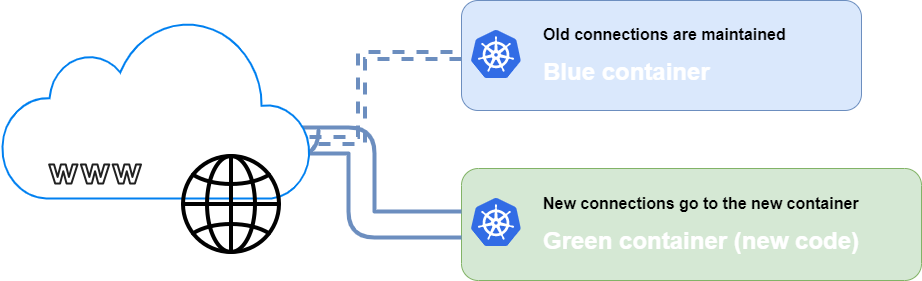
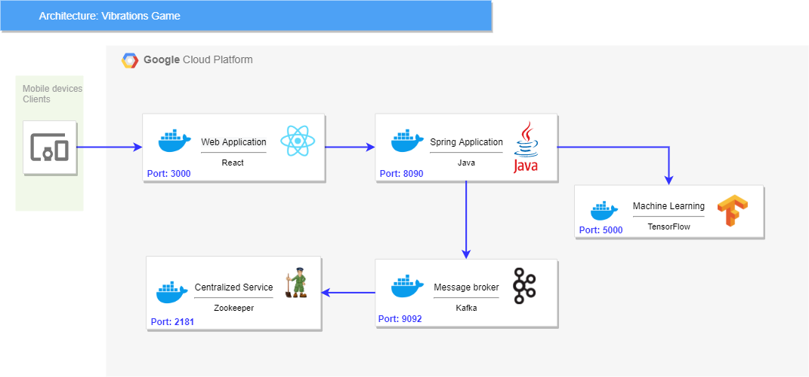

# VibrationsGame -Kubernetes 🕸️📳🎮
# LaSalle – Master's Final Project 🎓🏭


# Content 📇


* 1.  <a href="#1-kubernetes-container-architecture-"> Kubernetes Container Architecture </a>
* 2.  <a href="#2-services"> Services </a>
* 3.  <a href="#3-deployment-strategy-"> Deployment Strategy </a> 
* 4.  <a href="#4-installation-for-local-server"> Installation for local server </a> 
* 5.  <a href="#5-kubernetes-diagram-%EF%B8%8F%EF%B8%8F"> Kubernetes Diagram </a>


# 1. Kubernetes Container Architecture 📦📐

This project is in charge of encapsulating and orchestrate using Kubernetes all the services/containers mentioned here:

* Front-end - React
* Back-end - Java
* Back-end - Kafka
* Back-end - Zookeeper
* Back-end - Tensorflow - Motion Predictor

In order to carry out this deployment we will use the Google Cloud Platform (GCP) as a Server.


# 2. Services


| Service                                  | Port | Docker Image                                                       |
|------------------------------------------|------|--------------------------------------------------------------------|
| Front-end - React                        | 3000 | registry.gitlab.com/mdastfm/front-end-development:master           |
| Back-end - Java                          | 8090 | registry.gitlab.com/mdastfm/backend:master                         |
| Back-end - Kafka                         | 9092 | docker.io/bitnami/kafka:2                                          |
| Back-end - Zookeeper                     | 2181 | docker.io/bitnami/zookeeper:3                                      |
| Back-end - Tensorflow - Motion Predictor | 5000 | registry.gitlab.com/mdastfm/machinelearning/motionpredictor:v1.0.0 |


# 3. Deployment Strategy 🆙

Blue-green deployment is a technique that reduces downtime and risk by running two identical production environments called Blue and Green.

At any time, only one of the environments is live, with the live environment serving all production traffic. For this example, Blue is currently live and Green is idle.
As you prepare a new version of your software, deployment and the final stage of testing takes place in the environment that is not live: in this example, Green. Once you have deployed and fully tested the software in Green, you switch the router so all incoming requests now go to Green instead of Blue. Green is now live, and Blue is idle.



Command to execute manual blue/green deployment:

```kubectl patch service vibrationsgame-service-CURREN-TVERSION -p '{"spec":{"selector":{"version": "NEW-VERSION"}}}'  ```

# 4. Installation for local server

Programs needed:

* **Docker** página oficial: https://docs.docker.com/docker-for-windows/install/
  + Needed to run docker containers
* **Minikube** página oficial: https://kubernetes.io/es/docs/tasks/tools/install-kubectl/
  + In charge of deploying the pods (docker images) and establishing the different services.

### Run in local 🏠

Downloand repository on CMD commands:

```
  git clone https://gitlab.com/mdastfm/kubernetes
  cd kubernetes
``` 
 

Run kubectl:

```kubectl apply ``` 

# 5. Kubernetes Diagram 🕸️✍️




